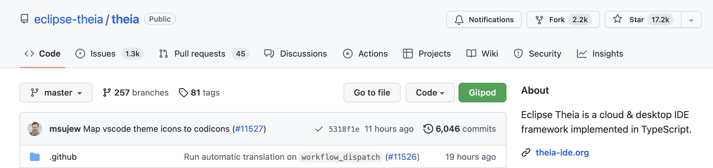
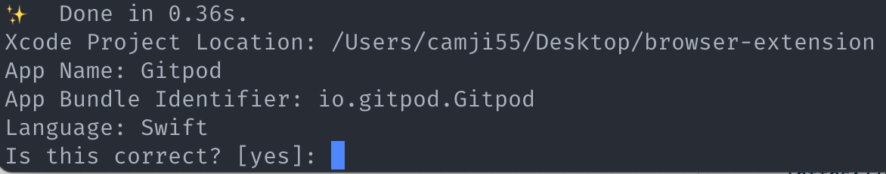

# Gitpod Browser extension
[](https://gitpod.io/#https://github.com/gitpod-io/browser-extension)

This is the browser extension for Gitpod. It supports Chrome (see [Chrome Web Store](https://chrome.google.com/webstore/detail/dodmmooeoklaejobgleioelladacbeki/)), Firefox (see [Firefox Add-ons](https://addons.mozilla.org/firefox/addon/gitpod/)) and Edge (see [how to install Chrome extensions](https://support.microsoft.com/help/4538971/microsoft-edge-add-or-remove-extensions)), and adds a **Gitpod** button to the configured GitLab, GitHub and Bitbucket installations (defaults to `gitlab.com`, `github.com`, `bitbucket.org`, and `gitlab.cn`) which immediately creates a Gitpod workspace for the current Git context:

 

### Issues

We are currently tracking all issues related to the browser extension in the [`gitpod-io/gitpod`](https://github.com/gitpod-io/gitpod) repository.
You can use the [`component: browser-extension`](https://github.com/gitpod-io/gitpod/issues?q=is%3Aissue+is%3Aopen+extension+label%3A%22component%3A+browser-extension%22) label to search for relevant issues including feature proposals and bug reports.

### Development

To make changes and test them using Gitpod itself: 
 
 - add test cases to the [unit test](https://github.com/gitpod-io/browser-extension/blob/se/plasmo/test/src/button-contributions.spec.ts#L39)
 - try out changes like this:
    1. run `pnpm build` 
    1. run `pnpm watch-prod` and download the built binary for your system (local machine)
    1. run the binary aywhere on your local machine tosync the extension folder locally.
    1. open Chrome and go to `chrome://extensions/`
    1. enable `Developer mode` (top right)
    1. click `Load unpacked` (top left) and select the folder you just downloaded
    1. now you can test your changes
    1. repeat step 1 and 2 and [reload the extension](chrome://extensions/) whenever you want to test new changes

#### Build

The build happens automatically when you start a workspace but if you want to build explicitly, use these commands:

```
pnpm install
pnpm build
pnpm package
```

### Testing

You can test the extension without publishing to the store. Before uploading the bundle to the browser, make sure to [build](#build) the code, then follow these steps:

For Chrome:

1. Rename `gitpod.xpi` to `gitpod.zip`
1. Unzip `gitpod.zip`
1. Open Chrome
1. Click Settings -> Extensions -> Load unpacked
1. Select the unzipped folder

For Firefox

1. Open Firefox
1. Go to `about:debugging#/runtime/this-firefox`
1. Click Load Temporary Add-on -> Select the `gitpod.xpi` file

For Safari (Experimental 🧪)

1. Open `Gitpod/Gitpod.xcodeproj`
1. Run the project with `cmd` + `r`. ⚠️ _Safari must have [**Allow Unsigned Extensions**](https://developer.apple.com/documentation/safariservices/safari_app_extensions/building_a_safari_app_extension) enabled._

## Release

We currently publish the extension for **Chrome** and **Firefox**.

To release a new version, follow these steps:

1. Bump up the version value inside `manifest.json`
1. Push your changes to `master`
1. Create a tag `vX.Y.Z`
1. Compose a list of changes using the list of commits that were pushed since last version
1. [Create a new release](https://github.com/gitpod-io/browser-extension/releases/new), listing changes:

    ```yaml
    ### Changes

    - Change/Fix A
    - Change/Fix B
    - Change/Fix C

    ### Credits

    Thanks to @{EXTERNAL_CONTRIBUTOR_USERNAME} for helping! 🍊
    ```

1. Start a new workspace using Gitpod
1. Download `gitpod.xpi` which is just been generated in your workspace

For Firefox:

1. Login to [addons.mozilla.org](https://addons.mozilla.org/) with user `info@gitpod.io`
1. Click on "See all versions"
1. Click on "Upload New Version"
1. Upload the `gitpod.xpi` file
1. Select only "Firefox" (leave empty "Firefox for Android")
1. Answer "No" at the question “Do you use any of the following in your extension?”
1. Click "Continue"
1. Click "Submit Version"
1. Wait a few hours for the review to happen!

For Chrome:

1. Using your Google account, open the [`gitpod-browser-extension Google Group`](https://groups.google.com/g/gitpod-browser-extension)
1. If you don't have access, reach out for [help in Slack](https://gitpod.slack.com/archives/C020VCB0U5A)
1. Once you are in the Google Group, make sure to "Switch to Gitpod" in the top navbar
1. Rename `gitpod.xpi` to `gitpod.zip`
1. Click "Upload new package"
1. Upload the zip file and submit
1. Wait a few hours for the review to happen!


### Safari

#### ⚠️ A machine running macOS and [Xcode 12+](https://developer.apple.com/xcode/) installed is required!

First, run the following to install dependencies and build the web extension:

```
yarn install && yarn build && yarn package
```

Then run the `build:safari` command to build the Safari extension around the web extension:

```
yarn build:safari
```



Hit `enter` when presented with this screen.

`Xcode` will open the `Gitpod.xcodeproj` automatically if it's installed.
